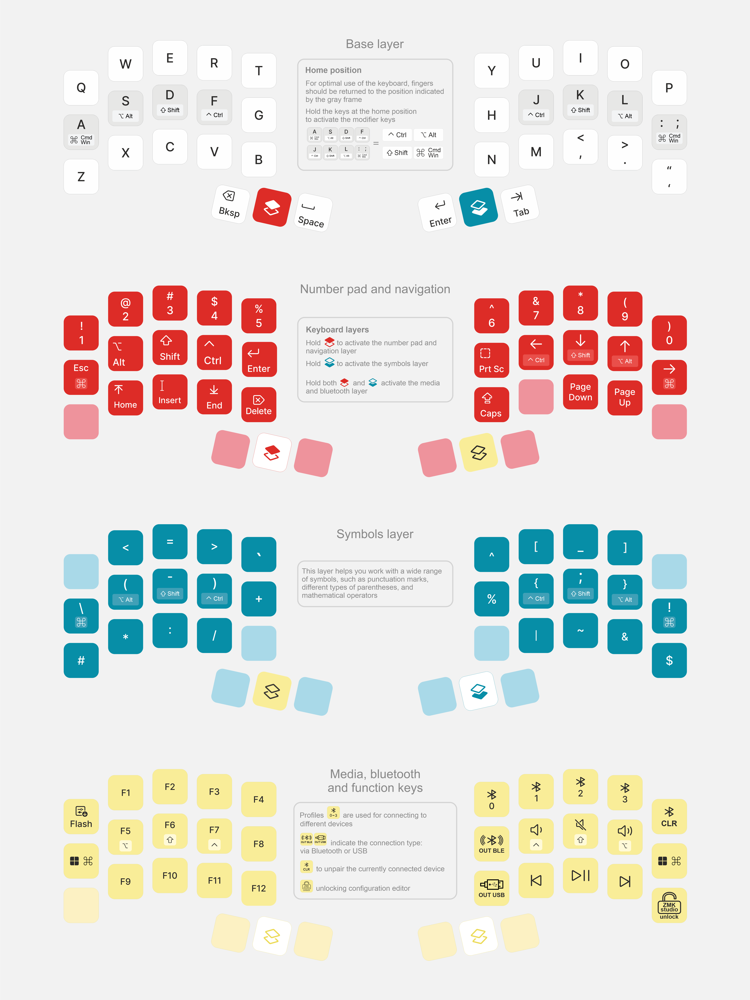

## Omega Point 36 is ultra-compact wireless mechanical keyboard

## Design philosophy
Omega Point 36 the most minimalist and compact keyboard we've ever created: easy to carry, wireless, and only 18 keys on each half, but we assure you that's enough with the sophisticated firmware that gives you advanced functions to customize the keyboard

## Features
- Split, ultra-compact, minimalist design
- Powered by nRF52840 and RMK/ZMK firmware
- 36 fully programmable keys and 15 additional layers for all your tasks
- Hot-swappable PCB (MX sockets)
- Bluetooth connectivity
- Rechargeable 120 mAh battery
- USB-C connection

## This repository contains all files related to this keyboard
PCB and schematic can be found [here](https://oshwlab.com/yuriiq/project_bdfypwfy)

### BOM

| Components | Quantity (pcs) |
| --- | ---: |
| Omega Point 36 PCB | 1 |
| E73-2G4M08S1C Bluetooth module | 2 |
| MX hotswap sockets | 36 |
| 1N4148W diodes, SOD-523F | 36 |
| B5819WS Schottky diode, SOD-323 | 2 |
| Resistor 0402 5.1 kΩ | 4 |
| Resistor 0402 100 kΩ | 2 |
| Resistor 0402 806 kΩ | 2 |
| Resistor 0402 2 MΩ | 2 |
| Resistor 0402 10 kΩ | 2 |
| Capacitor 0402 4.7 µF | 4 |
| P-channel MOSFET, SOT-23, JSM2301S | 2 |
| MSK12CO2-SZ SMD slide switch | 2 |
| LN2054Y42AMR linear Li-Ion battery charger, SOT-23-5 | 2 |
| ZX-SH1.0-2PWT SMD wire-to-board connector | 2 |
| AP2112K-3.3TRG1 LDO regulator, SOT-23-5 | 2 |
| SMD USB connector USB-TYPE-C-018 | 2 |
| TS5235A 250gf 025 SMD tactile switch | 2 |
| Li-Pol, 3.7V, 120mAh, 401230 with JST SH-1.0mm, 2 pin connector	 | 2 |
| 3M bumpons (8 mm) | 8 |
| MagSafe ring (optional) | 2 |

## License
The files in this repository are licensed under the Creative Commons Attribution-NonCommercial-ShareAlike 4.0 International License

## Useful links

- [Case for 3D printing (STL)](stls)
- [Case model for editing (STEP)](step)
- [Circuit schematic](https://oshwlab.com/yuriiq/project_bdfypwfy)

### Firmware
- [Pre-compiled files](https://github.com/ergohaven/keymap_hub)
- [RMK source code](https://github.com/ergohaven/rmk-eh)

## Availability
The complete keyboard (not a DIY kit) is available for purchase at [eh.industries](https://eh.industries/)
